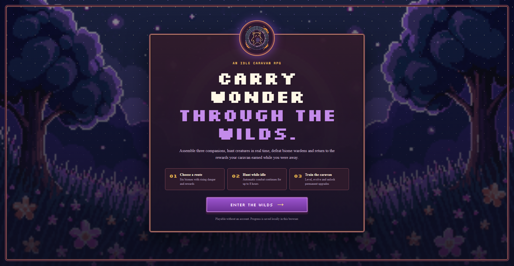
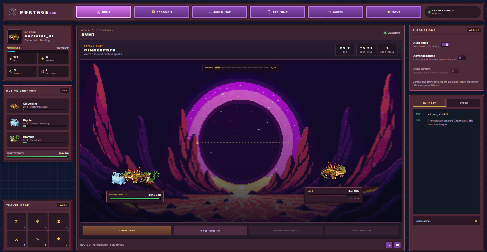
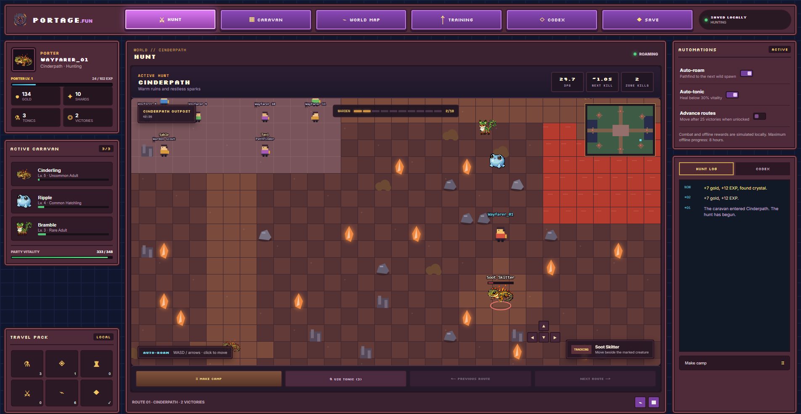

# Portage.fun

*Este repositório está atualizado.*

**Live demo:** https://portage-topaz.vercel.app







A cozy idle creature-collecting RPG. The current browser build prioritizes a playable,
local-first hunt loop; the Starknet contracts remain in the repository for later integration.

## Current status

- **Playable top-down idle RPG:** tile movement, click-to-move, camera, collision, populated
  outposts, NPCs, spawn regions, auto-roam pathfinding, spatial combat and a minimap.
- Six routes include Wardens, shared EXP, loot, party management, evolution, permanent
  training and up to eight hours of offline progress.
- Progress autosaves locally and unsafe offline fights make camp instead of fabricating rewards.
- See [`docs/IDLE_GAME.md`](docs/IDLE_GAME.md) for mechanics, balance rules and architecture.
- Creature minting, stats, evolution, expeditions and listing logic are implemented in Cairo.
- The Next.js app supports mock mode and a configured Portage contract.
- **The deployed game is local-first and touches no chain.** The client at the demo URL runs
  the simulation in the browser and saves to `localStorage`; no wallet, contract or STRK20
  call is reachable from it. The privacy code below is written and typechecked but is not
  yet surfaced in any screen.
- Shield, private transfer, unshield and explicit shielded-balance sharing are implemented
  against `WalletAccountV6` in `app/src/utils/strk20.ts`, with capability detection and
  explicit consent; the app never handles viewing keys or proofs. No Mainnet run has been
  performed and `strk20.json` carries no transaction evidence yet.
- **Mainnet is intentionally gated:** the current caller-seeded hatch is verifiable but
  grindable — the caller picks the seed, so it must not be called provably fair — and
  marketplace `buy` does not yet transfer STRK. Commit/reveal and an audited Portage
  anonymizer/settlement flow are required before production deployment.

## What stays private?

| Private inside STRK20 | Public onchain |
|---|---|
| Shielded balance, private-transfer sender/recipient and amount | Shield/unshield address, amount and timing |
| User address behind a correctly designed anonymizer action | Portage action, revealed creature metadata and NFT owner |

STRK20 protects ERC-20 value; it does not hide NFT `owner_of` or revealed metadata. New
notes mature after roughly 10 blocks, so shield first and pay later rather than correlating
a public deposit with a private action. See [What is STRK20](https://strk20-by-example.org/what-is-strk20).

## Repository

- `contracts/` — Cairo Portage core and 24 Starknet Foundry tests
- `app/` — Next.js 16 idle game client, deterministic local engine and privacy integration code
- `scripts/` — ABI export, guarded deployment and submission validation
- `docs/` — specification, deployment runbook, demo script and sprint checklist

## Local development

Requirements: Node.js 24+, npm, Scarb 2.18+.

```bash
npm ci
npm --prefix app ci
cp app/.env.example app/.env.local
npm run build:contracts
npm run test:contracts
npm run build:app
npm run validate:submission
```

Set browser RPC URLs and `NEXT_PUBLIC_PORTAGE_ADDRESS` in `app/.env.local`. Keep it at
`0x0` for mock mode. Ready is the current wallet used for manual STRK20 verification;
unsupported wallets stay in public mode without triggering a balance-consent prompt.

## Deployment

Follow [`docs/DEPLOYMENT.md`](docs/DEPLOYMENT.md). The script requires an explicit
network and reads credentials only from the process environment:

```bash
PORTAGE_NETWORK=sepolia PORTAGE_RPC_URL=https://... \
DEPLOYER_ADDRESS=0x... DEPLOYER_PRIVATE_KEY=0x... npm run deploy
```

Mainnet additionally requires `CONFIRM_PORTAGE_MAINNET=DEPLOY_PORTAGE_MAINNET` and must
not proceed until the hatch and settlement security gates are closed.

## Sprint submission

`strk20.json` remains empty until evidence exists. Never fabricate hashes or URLs.

```bash
npm run validate:submission             # readiness, empty evidence allowed
STRK20_MAINNET_RPC_URL=https://... npm run validate:submission:final
```

Final mode requires 3+ successful SN_MAIN transactions that emitted events from the
canonical STRK20 pool, at least one deployed contract, a demo URL and a video URL.
The recording plan is in [`docs/DEMO_SCRIPT.md`](docs/DEMO_SCRIPT.md).

License: MIT.
